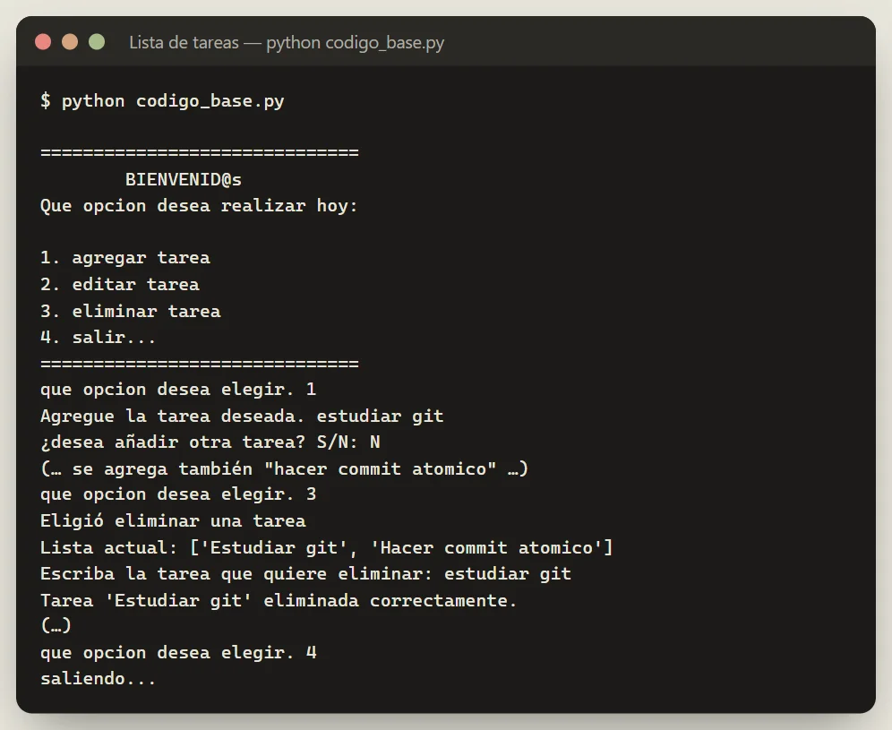
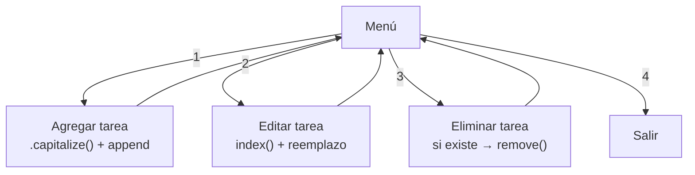

# Lista de tareas en consola — primer ejercicio de Git

Programa de consola en **Python** para gestionar una lista de tareas (agregar, editar y eliminar) con un menú interactivo. Es el código base de mi primer ejercicio de **Git y GitHub**: crear el repositorio, hacer el primer commit y subirlo.

La evolución de este mismo código (refactor a funciones y a módulos, cada uno en su rama) está en [`ejercicios-git-`](https://github.com/Eidan210/ejercicios-git-).




## El problema

Antes de trabajar con ramas y pull requests hace falta dominar lo básico: versionar un programa propio, escribir un commit con un mensaje que explique el cambio y publicarlo en GitHub. Una lista de tareas en consola es un proyecto lo bastante pequeño para centrarse en ese flujo.

## Tecnologías

| Tecnología | Para qué se usa |
| :--- | :--- |
| **Python 3** | Menú con `while True`, listas, `input()` y métodos de cadena como `capitalize()`. |
| **Git y GitHub** | Repositorio, primer commit y publicación del código. |

## Funciones clave

- **Menú interactivo** con 4 opciones que se repite hasta elegir *salir*.
- **Agregar tareas** normalizadas con mayúscula inicial, con la opción de seguir agregando.
- **Editar una tarea** buscándola por su texto y reemplazándola en su posición.
- **Eliminar una tarea**, comprobando antes que existe y avisando si no se encuentra.

## Evidencias

La captura de arriba es una ejecución real: se agregan dos tareas y se elimina una.



### Mejoras identificadas

Revisando el código encontré estos puntos. La versión modular de [`ejercicios-git-`](https://github.com/Eidan210/ejercicios-git-) ya corrige el mensaje de edición; el resto sigue pendiente:

- La validación `opcion <= 0 and opcion >= 5` nunca se cumple; debería usar `or`.
- `int(input(...))` termina el programa si se escribe algo que no es un número.
- Al editar se muestra `error` aunque el cambio se haya hecho bien, y si la tarea no existe, `index()` lanza un `ValueError`.

## Instalación y uso

Requiere Python 3:

```bash
git clone https://github.com/Eidan210/ejercicio-git.git
cd ejercicio-git
python codigo_base.py
```

## Aprendizajes

- **El flujo básico de Git:** `init`, `add`, `commit` y `push` sobre un proyecto propio.
- **Estructurar un programa de consola** con un bucle de menú y operaciones sobre listas.
- **Leer mi propio código con ojo crítico:** detectar condiciones que nunca se cumplen y entradas que rompen el programa.

---

Desarrollado por **Eidan Alexander Carreño** ([@Eidan210](https://github.com/Eidan210)).
